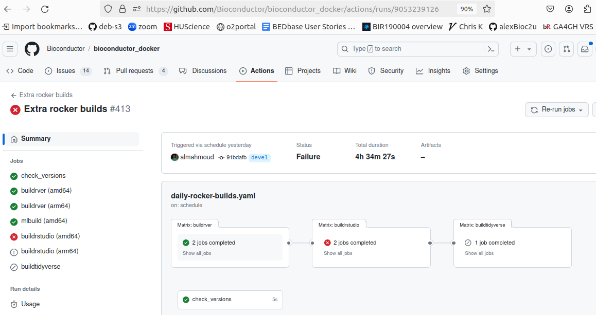

# Overview

Bioconductor containers work with Docker, Singularity, podman,
and possibly other container engines.  This document details
the production, distribution, and maintenance of containers
in the Bioconductor project.

